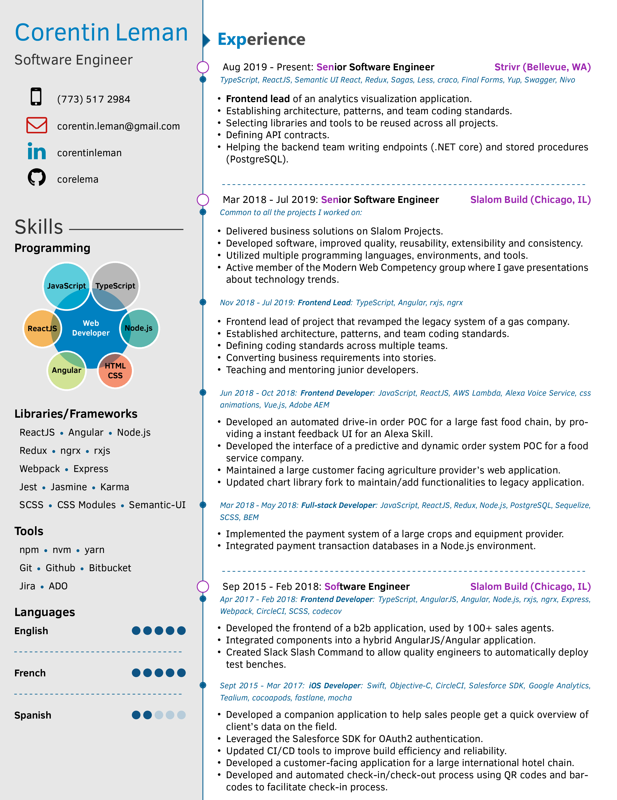

# My Resume




[Download](resume.pdf)

## LaTeX resume templates used

These are the templates I compiled and used to create it:

1. [Harsh Gadgil's LaTeX resume template](https://github.com/opensorceror/Data-Engineer-Resume-LaTeX)
2. [Liantze's AltaCV](https://github.com/liantze/AltaCV)

## Compilation (Linux)

1. Install TexLive, then run: `xelatex resume.tex`

2. To create the screenshots, install ImageMagick, then run `convert -background white -alpha remove -alpha off -density 300 resume.pdf -quality 100 resume.png`

## License

```
Copyright 2016 Harshavardhan Gadgil

Licensed under the Apache License, Version 2.0 (the "License");
you may not use this file except in compliance with the License.
You may obtain a copy of the License at

   http://www.apache.org/licenses/LICENSE-2.0

Unless required by applicable law or agreed to in writing, software
distributed under the License is distributed on an "AS IS" BASIS,
WITHOUT WARRANTIES OR CONDITIONS OF ANY KIND, either express or implied.
See the License for the specific language governing permissions and
limitations under the License.
```

